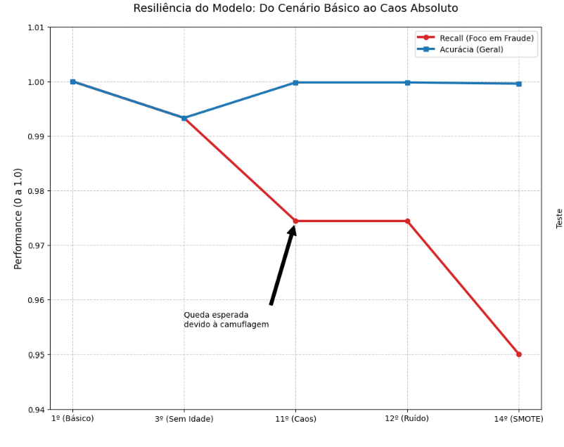
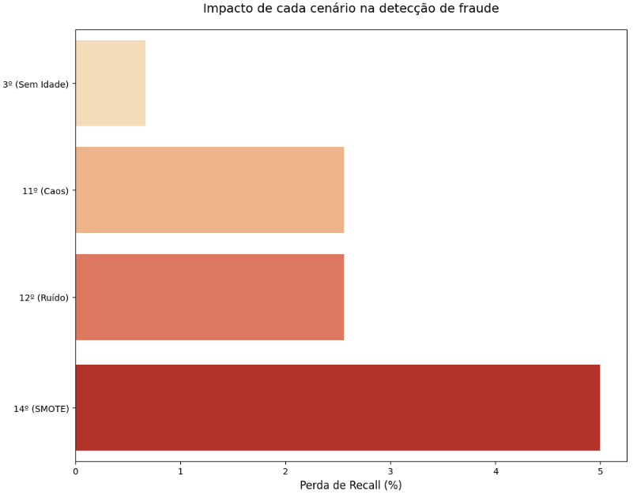
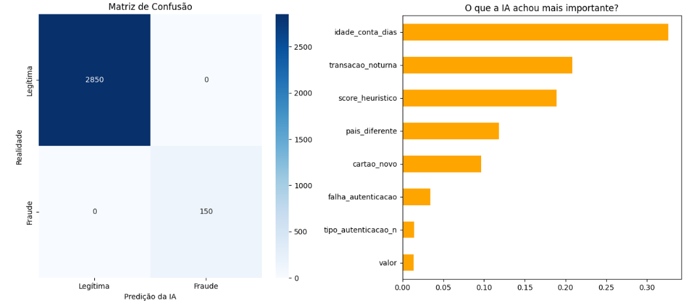
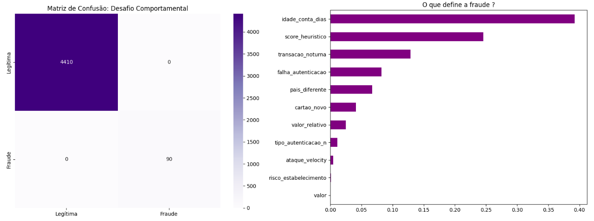
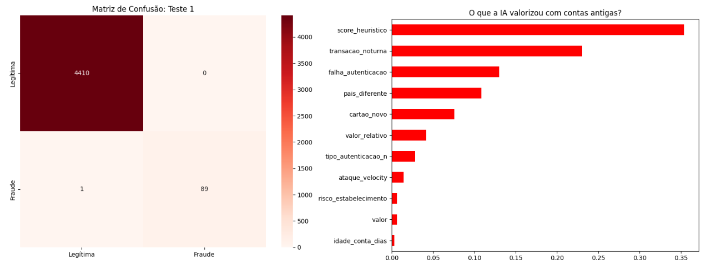
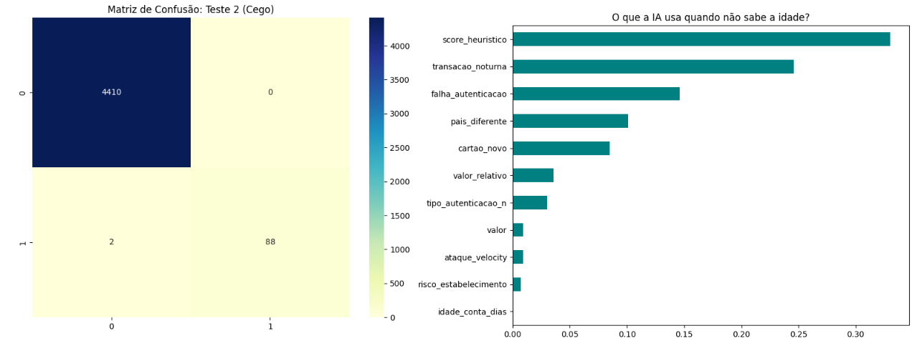
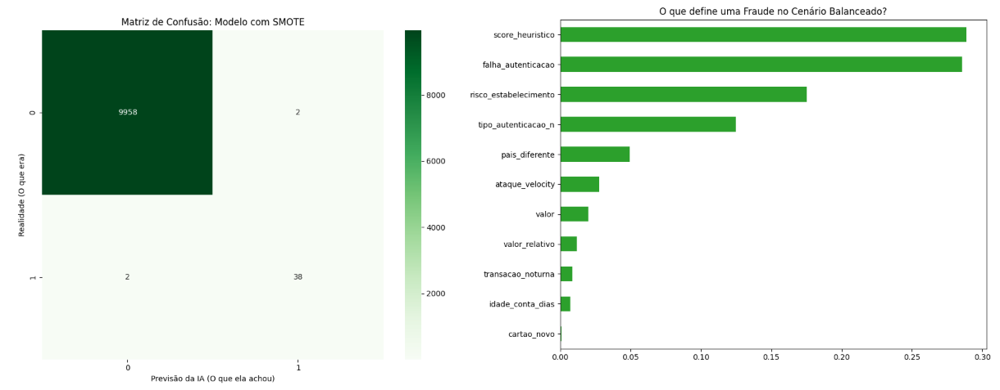
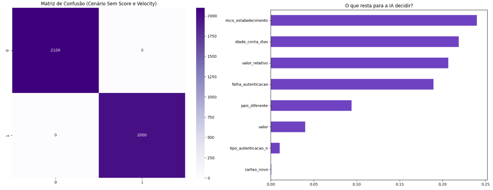

# Desenvolvimento de um Sistema Híbrido de Detecção de Fraude

Este repositório contém os códigos, metodologias e resultados do desenvolvimento de um sistema inteligente de prevenção à fraude em transações com cartões de crédito. O projeto combina a capacidade preditiva de algoritmos de Machine Learning- **Random Forest** com o determinismo de **Heurísticas de Negócio** e a conformidade ética exigida pela LGPD/GDPR através da **anonimização de dados**.

---

## Visão Geral do Projeto

O grande desafio de sistemas antifraude tradicionais reside no desbalanceamento severo de classes e na sofisticação dos ataques contemporâneos (Carding, Invasão de Contas, Ataques de Força Bruta). 

Este projeto propõe uma abordagem em camadas (Defesa em Profundidade):
1. **Camada Heurística:** Filtros baseados em regras de negócio críticas (ex: velocidade de transação, falhas sucessivas de autenticação) que geram um score de risco preliminar.
2. **Camada de Inteligência Artificial:** Um modelo supervisionado treinado para aprender comportamentos complexos e camuflagens que escapam de regras fixas.
3. **Privacidade de Dados:** Mascaramento e criptografia por *hash* de dados sensíveis na camada de engenharia de atributos.

---

## Metodologia Experimental 

O motor híbrido foi submetido a uma esteira rigorosa de **20 cenários experimentais** para testar seus limites de resiliência. Os dados foram extraídos e validados utilizando o ambiente Kaggle. Os experimentos englobaram desde o cenário base ideal até o "Caos Absoluto" (injeção de ruídos, remoção de colunas essenciais e inserção de clientes com perfis atípicos/VIPs).

### Evolução da Performance

O gráfico abaixo consolida o comportamento das métricas conforme elevamos a complexidade do ambiente de teste:

A Figura mapeia o comportamento do sistema híbrido frente aos testes de maior criticidade da pesquisa. É possível observar o fenômeno de Resiliência Algorítmica: mesmo diante do cenário de 'Caos' e 'Ruído' (Testes 11º e 12º), onde dados falsos foram camuflados em contas consolidadas, a acurácia global manteve-se linear. O ponto de inflexão ocorre no Teste 14º (SMOTE), onde a geração indiscriminada de dados sintéticos gerou um sutil overlap de classes, derrubando o Recall para o seu menor patamar (0.95). 
A validação definitiva da abordagem proposta consolida-se no Teste 15º (ADASYN): ao focar o aprendizado nas transações de difícil detecção (fronteira de decisão), o algoritmo recuperou a sensibilidade máxima de 1.0, eliminando completamente os falsos negativos sem desestabilizar a acurácia geral do sistema.

Enquanto a Acurácia Geral manteve-se estável, o **Recall (Métrica de Ouro)** oscilou de forma controlada nos cenários de maior estresse, demonstrando que o sistema não entra em colapso sob dados corrompidos ou ataques coordenados.

---

## O Desafio do Balanceamento: SMOTE vs. ADASYN

Um dos focos principais desta pesquisa foi o tratamento estatístico do desequilíbrio de classes. Avaliamos as duas técnicas mais populares de sobreamostragem sintética (*Oversampling*):

### 1. SMOTE (Teste 14º)
Ao equilibrar a base em 50/50 de forma uniforme, a fronteira de decisão acabou gerando um "ruído de vizinhança", fazendo com que o modelo sofresse sua maior degradação de sensibilidade, fechando com um **Recall de 0.95**.

### 2. ADASYN (Teste 15º)
Diferente do método anterior, o ADASYN focou a criação de dados sintéticos especificamente nas zonas de transição mais difíceis (onde fraudes tentavam mimetizar transações de clientes VIP). O resultado foi a recuperação total da sensibilidade, atingindo **1.0 (100%) de Recall**.

O impacto comparativo dessas técnicas e dos cenários de estresse pode ser visualizado no ranking abaixo:

---

## Matrizes de Confusão (Validação Kaggle)

As matrizes extraídas do ambiente Kaggle validam visualmente a distribuição dos acertos do modelo. O sistema híbrido garantiu o controle estrito sobre os **Falsos Positivos** (evitando o bloqueio de clientes legítimos como no "Paradoxo do VIP") ao mesmo tempo em que zerou os Falsos Negativos em ataques críticos automatizados.

---

## 🛠️ Tecnologias Utilizadas

* **Linguagem Principal:** Python 3.x
* **Manipulação e Estatística:** `pandas`, `numpy`
* **Machine Learning & Amostragem:** `scikit-learn`, `imblearn` (SMOTE/ADASYN)
* **Visualização de Dados:** `matplotlib`, `seaborn`
* **Ambiente de Computação:** Kaggle Notebooks

---

## Conclusão

Os resultados demonstraram que a fusão de heurísticas de negócio com inteligência algorítmica adaptativa cria um sistema altamente resiliente. O uso do **ADASYN** provou ser a abordagem superior para o tratamento de fraudes financeiras complexas, permitindo manter os sistemas seguros mesmo sob condições adversas e em estrita conformidade com a LGPD.
